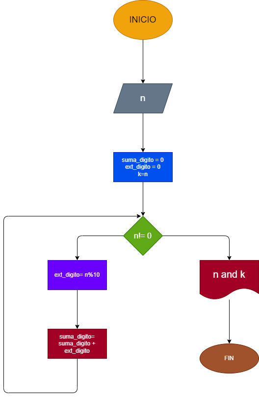

# Hacer diagrama de flujo y programa en python que lea un numero n, entero y positivo de cualquier número de digitos, que calcule la suma de sus dígitos y que la imprima junto con el número leído.

## Diagrama de Flujo

