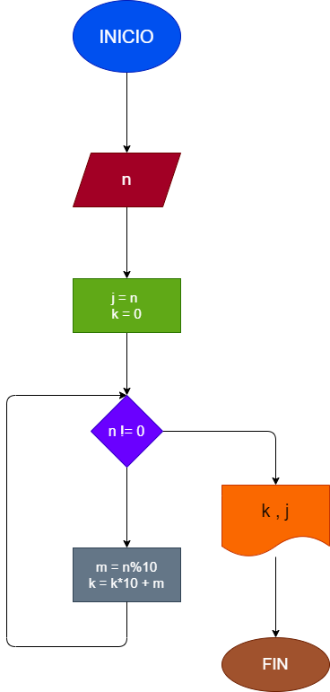

# Hacer diagrama de flujo y programa que lea un numero n, entero y positivo de cualquier numero de digitos, que calcule su numero inverso y que lo imprima junto con el numero leído.

## Diagrama de Flujo

