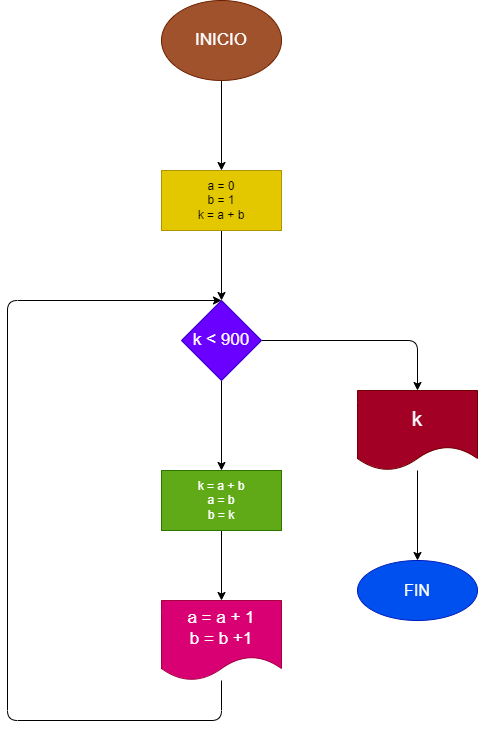

# La serie fibonacci es una serie numérica en la cual cada elemento es la suma de los dos anteriores tomando como variables los dos numeros iniciales a=0 y b=1. Hacer el programa en Python y Diagrama de flujo que calcule e imprima a partir del tercero todos los elementos de la serie fibonacci que sean menores de 1000.

## Diagrama de Flujo

